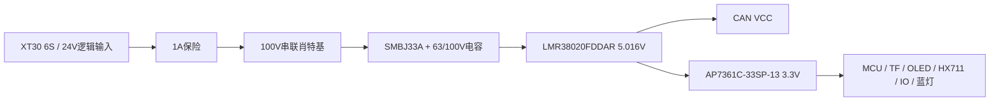

# Rev.A 电源设计与预算

## 电源树

## 输入保护

- J_POWER：XT30PW-M30.G.Y / C431092，pin1=24V_IN，pin2=GND；只给逻辑供电。
- F1：Littelfuse 0451001.MRL / C3099，1A、2410。数据手册规定的分断能力为300A@32VDC、50A@125VDC；它不是任意 LiPo 短路电流下的保证。上游电池支路必须有适当分断能力的保护，配合线束、电池短路能力、熔断 I²t、热降额和上电浪涌复核。
- D_REVERSE：GOODWORK SS310 / C2848687，SMA、100V/3A，阳极接保险后，阴极接受保护输入。压降和热量用实测电流/温度下 Vf 计算；这不是理想二极管。
- D_INPUT：MDD SMBJ33A / C173526，VRWM=33V，高于25.2V满电；击穿36.7–40.6V，额定脉冲条件下 VC=53.3V@11.3A，600W、10/1000µs。该值低于 Buck 的80V工作上限，但线束寄生、脉冲电流和温度仍要验证。
- 输入电容：47µF/63V Panasonic 63SXV47M，4.7µF/100V AVX1210，100nF/100V Samsung0805。没有25V输入电容。TVS 后所有相关器件都要承受实际残余尖峰；电感绕组的电压耐受未在采购参数中保证，待厂家确认。
- EN接VIN，没有额外电池低电压切断。本板不负责6S电池均衡/欠压保护，需要上游电池管理或供电系统承担。

## Buck 数值依据

依据 [TI LMR38020 官方数据手册](https://www.ti.com/lit/ds/symlink/lmr38020.pdf)，SNVSC40E，Table 8-1、Table 9-1、5V/2A设计示例。

| 项 | 本设计 |
| --- | --- |
| 完整型号 | LMR38020FDDAR / C5149193，DDA PowerPAD-8 |
| 引脚 | 1GND、2EN、3VIN、4RT/SYNC、5FB、6PG、7BOOT、8SW、EP9GND |
| 频率 | RT64.9kΩ→GND，400kHz；商城泛化的525kHz参数不是本电阻设定值 |
| 电感 | SMDRI127-150MT / C40000，15µH±20%，DCR27mΩ，标称Isat8A、Irms4.5A，按厂家测量条件使用 |
| 分压 | 100kΩ / 24.9kΩ，各1%；VOUT=1×(1+100/24.9)=5.016V，精度还含VREF误差 |
| 输出电容 | 3×22µF/25V X7R 1210；需核算偏压、温度、容差后的有效容量及环路 |
| 输入 | 4.7µF100V+100nF100V贴近VIN/GND，47µF63V储能 |
| Bootstrap | 100nF，BOOT↔SW；不能接地 |
| VCC | 此封装无外接VCC脚，不增加不存在的VCC电容 |
| EN / PG | EN接VIN；PG开漏经100k上拉3V3并接测试点，不占GPIO |

25.2V、400kHz、15µH时，`ΔIL=VOUT×(1−VOUT/VIN)/(f×L)≈0.670A`；2A负载峰值约2.335A。此计算支持初选，不替代低电感/低频容差、磁芯温升、启动和限流复核。5V至少1A可用、按2A留能力是**设计目标**，须经过下一轮布局、热和瞬态验证。

图页标注 `CRITICAL LAYOUT AREA`。VIN旁路回路、BOOT-SW回路、SW铜面积、反馈取样和PowerPAD热过孔必须按TI推荐布局。

## 3V3 与蓝色灯

AP7361C-33SP-13 / C4943338，SO-8EP：1OUT、2EN、3NC、4GND、5/6/7NC、8IN、EP接地。输入与输出各10µF/25V0805，EN接5V。依据 [Diodes AP7361C](https://www.diodes.com/datasheet/download/AP7361C.pdf)，固定版本需要满足最小有效输入/输出电容和稳定性要求；SO-8EP热指标与铜面积/热过孔条件相关。

LED_PWR=ORH-B35A蓝色0805 / C205441，3V3→470Ω→阳极，阴极接地，丝印PWR。若低电流Vf≈2.83V，I≈1mA。其手册只保证20mA时的Vf范围，不能保证此处的0.5–2mA；样板需实测并在0805系列内调整电阻。

## 电流预算：设计估算，不是所有模块的保证上限

外部 OLED/HX711 模块和 TF 卡具体批次尚未冻结。下表预留峰值用于发现风险，必须以实际料号/温度下测量更新。MCU电流受168MHz、外设、负载、温度影响。

| 3V3 负载 | 标称预算mA | 峰值预算mA |
| --- | ---: | ---: |
| STM32F407 / HSE | 110 | 150 |
| TF 卡 | 40 | 250 |
| OLED | 25 | 40 |
| HX711 远端供电 | 10 | 15 |
| 上拉及接口 | 5 | 10 |
| 蓝色LED | 1 | 2 |
| 其他/余量 | 20 | 30 |
| CAN VIO | 0.17 | 0.30 |
| **合计** | **211.17** | **497.30** |

CAN VIO数据来自所选SIT器件手册显性状态典型/最大值；其VCC显性最大70mA。5V预算取CAN平均25mA、峰值70mA，并为LDO静态电流等预留约1mA：5V约237mA标称、568mA峰值，对应约1.19W/2.85W。

假设Buck效率85%、肖特基压降0.5V，输入估算 `Iin≈P5V/[0.85×(VIN−0.5)]`：

| 输入 | 标称 | 峰值 |
| --- | ---: | ---: |
| 18V（预算低压点，并非电池放电许可） | 80mA | 192mA |
| 22.2V | 65mA | 155mA |
| 25.2V | 57mA | 136mA |

以上不含上电浪涌，85%是保守预算假设而非已测效率。5V满2A时18V输入约0.67A，需重新复核保险热降额、输入浪涌和整板温升。

## LDO 热约束：当前主要风险

`P=(5.016−3.3)×I`：标称0.362W、峰值0.853W；标称1A会达到1.716W。

以5.2V输入、3.267V输出为保守预算角点，497.3mA产生约0.961W。SO-8EP数据手册θJA约100°C/W，**仅对应其指定测试板条件，不是本板保证值**。若环境50°C且该峰值长期持续，估算结温约146°C，不能当作可持续工作点。

若设计结温目标125°C、环境50°C，使用上述100°C/W和1.933V压差估算连续电流约388mA；环境85°C时只有约207mA。即使标称负载，也必须检查高温余量。峰值持续时间、实际PCB热阻、铜面积、热过孔和卡写入占空比都未验证。

**结论：保留用户指定AP7361C方案作为Rev.A审图候选，不宣称3V3连续1A能力。** 下一轮须测温并冻结环境/负载边界；若无法满足，提交更改电源方案的审图决定，不能直接进入生产。
